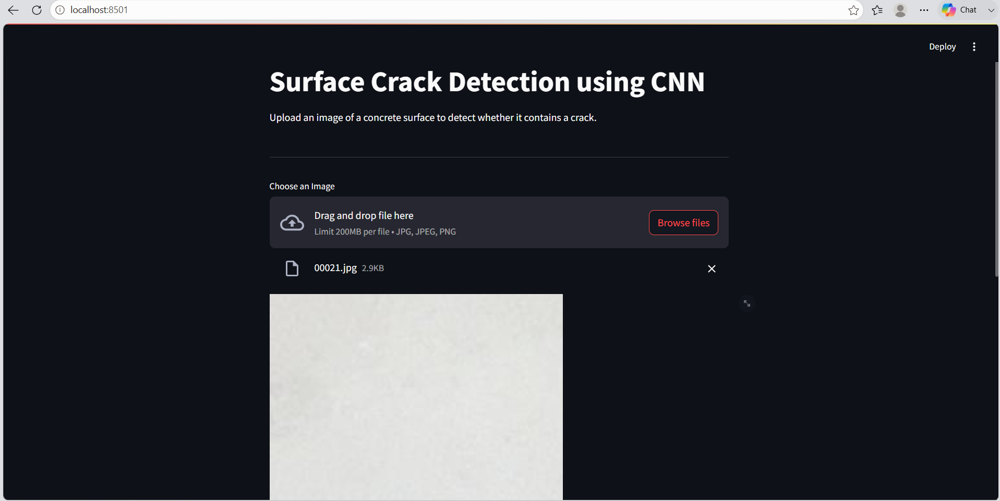

# Surface Crack Detection using CNN

A Deep Learning project that automatically detects cracks on concrete surfaces using a Convolutional Neural Network (CNN). The model classifies images into **Crack** and **No Crack** categories, providing a simple and efficient solution for structural inspection.

---

## Overview

Manual inspection of concrete structures is time-consuming and prone to human error. This project uses a CNN model trained on concrete surface images to automate crack detection. The application also provides a user-friendly Streamlit interface for image upload and prediction.

---

## Features

- Binary image classification (Crack / No Crack)
- CNN model built using TensorFlow and Keras
- Image upload using Streamlit
- Prediction confidence score
- Model evaluation using Confusion Matrix and Classification Report
- Modular project structure
- Clean and interactive user interface

---

## Technologies Used

| Category | Technology |
|----------|------------|
| Programming Language | Python |
| Deep Learning | TensorFlow, Keras |
| Computer Vision | OpenCV |
| Web Framework | Streamlit |
| Data Processing | NumPy |
| Visualization | Matplotlib |
| Machine Learning | Scikit-learn |

---

# Application Screenshots

## Home Page



---

## Prediction Result - Crack Detected


---

## Prediction Result - No Crack


---

# Project Structure

```text
Surface Crack Detection using CNN
│
├── app/
│   ├── app.py
│   └── predict.py
│
├── assets/
│   └── screenshots/
│       ├── home.png
│       ├── crack_prediction.png
│       └── no_crack_prediction.png
│
├── data/
│   ├── Positive/
│   └── Negative/
│
├── models/
│   └── best_model.h5
│
├── notebooks/
│   ├── 01_Data_Preparation.ipynb
│   ├── 02_CNN_Model.ipynb
│   ├── 03_Model_Training.ipynb
│   └── 04_Model_Evaluation.ipynb
│
├── .gitignore
├── LICENSE
├── README.md
└── requirements.txt
```

---

# CNN Architecture

```text
Input Image (120 × 120 × 3)

↓

Conv2D (32 Filters)

↓

MaxPooling2D

↓

Conv2D (64 Filters)

↓

MaxPooling2D

↓

Conv2D (128 Filters)

↓

MaxPooling2D

↓

Flatten

↓

Dense (128)

↓

Dropout (0.5)

↓

Dense (1)

↓

Sigmoid
```

---

# Model Workflow

```text
Dataset

↓

Image Preprocessing

↓

Training Dataset

↓

CNN Model

↓

Model Training

↓

Model Evaluation

↓

Prediction Module

↓

Streamlit Application
```

---

# Model Performance

The trained CNN model achieved high classification accuracy on the validation dataset.

Evaluation includes:

- Validation Accuracy
- Binary Cross-Entropy Loss
- Confusion Matrix
- Classification Report

> Performance may vary slightly depending on training parameters and hardware configuration.

---

# Dataset

This project uses the **Concrete Crack Images for Classification** dataset.

Dataset Link:

https://www.kaggle.com/datasets/arunrk7/surface-crack-detection

Directory Structure

```text
data/
│
├── Positive/
└── Negative/
```

---

# Installation

Clone the repository

```bash
git clone https://github.com/VinitaPatil2005/Surface-Crack-Detection-using-CNN.git
```

Move into the project directory

```bash
cd Surface-Crack-Detection-using-CNN
```

Install the required dependencies

```bash
pip install -r requirements.txt
```

---

# Run the Application

Start the Streamlit application

```bash
streamlit run app/app.py
```

---

# Prediction Labels

| Prediction | Description |
|------------|-------------|
| Positive | Crack Detected |
| Negative | No Crack Detected |

---

# Future Enhancements

- Multi-class crack severity detection
- Real-time video crack detection
- Transfer Learning using ResNet50 or EfficientNet
- Model deployment using Docker
- Cloud deployment on Streamlit Community Cloud

---

# Author

**Vinita Patil**

Bachelor of Engineering (Artificial Intelligence and Machine Learning)

GitHub

https://github.com/VinitaPatil2005

LinkedIn

https://www.linkedin.com/in/vinita-patil-a87052303/

---

If you found this project useful, consider giving it a ⭐ on GitHub.
